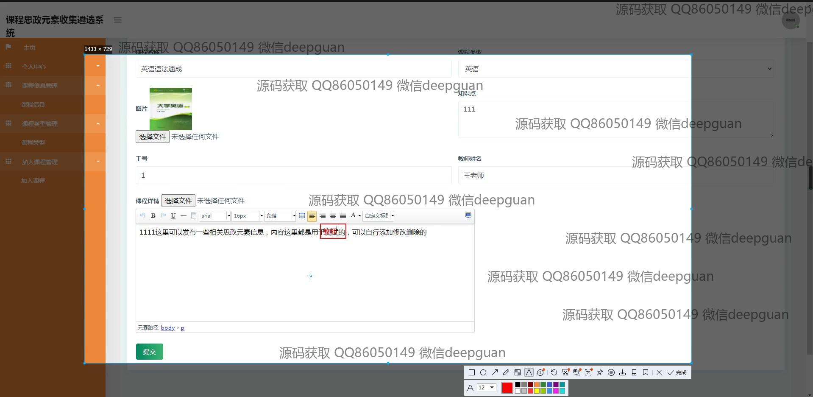

<h1 align="center">的课程思政元素收集系统</h1>

## 简介
课程思政元素收集系统：角色分为管理员、教师、用户；支持课程信息管理、课程类型管理、论坛互动、留言反馈、用户管理及思政元素筛选编辑功能。    --计算机毕业设计源码；毕设源码；java毕业设计源码

## 联系方式

<h3 align="center">获取完整代码与数据库文件 + 微信：deepguan QQ: 86050149 QQ群: 783742310</h3>

<h3 align="center">可帮忙远程部署 包运行成功！提供远程部署、修改代码、设计文档指导、代码讲解等服务！</h3>

## 功能介绍（完整见运行截图）
管理员：管理员可以通过系统登录界面访问该系统，进行用户注册和退出操作。用户管理模块允许管理员查看和更新用户信息，包括增删改查功能。课程信息管理模块提供课程新增、修改和删除功能，并支持课程审核与状态管理。管理员可以管理课程类型，组织思政元素，发布或关闭信息，为论坛和留言板管理提供后台支持，以便系统有效运作。

教师：教师通过系统进行身份验证后，可以访问个人中心，管理个人信息和账户安全。教师可以在课程管理模块中录入和编辑个人教授的课程信息，上传相关材料，并添加课程思政元素。教师在论坛和留言板模块中分享和交流思政元素内容，回应学生反馈，通过个人中心查看发表及收藏的内容，提升教学质量和参与度。

用户（学生）：学生可以通过系统登录模块访问个人账户及退出，选择并加入感兴趣的课程。用户能够在论坛模块中发帖、留言并反馈，对课程进行评论和互动。同时，访问个人中心可以查看和更新个人信息以及收藏内容，通过搜索功能查找具体课程信息和思政元素，大力提高学习效率和参与感。

## 运行截图

本代码来源于网络,仅供学习参考使用!

